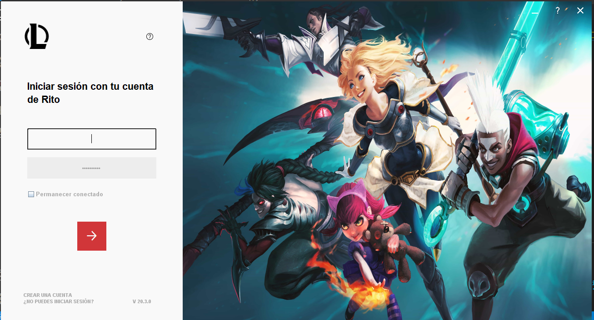
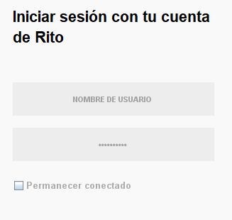
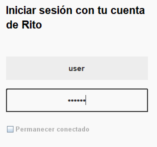
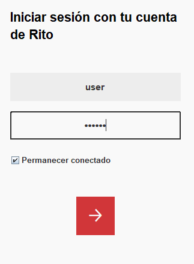
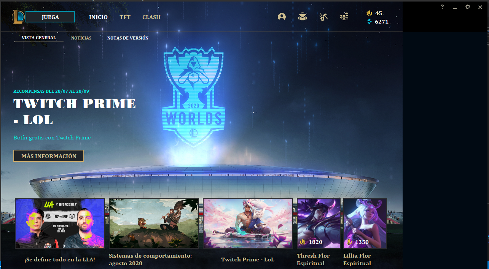
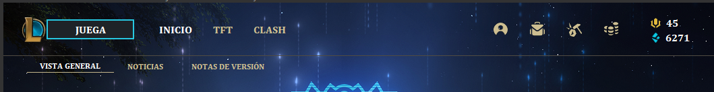
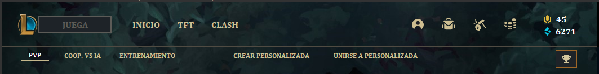

# Actividad # 8 - Eventos de mouse
## Josue Nuñez Prada

En esta actividad se incorporan los eventos de mouse en diferentes partes del proyecto.

Se agregaron eventos de mouse a la vista de login, en los botones y en los campos de texto para reconocer cuando el usuario pasa el raton por los txt de nombre de usuario y clave de usuario, se cambia el fondo, el color de la letra, y el borde de cada txt de manera que se reconoce en que campo esta enfocado el usuario.

Se agregaron efectos en los botones que manejan las pestañas del proyecto de manera que se identifica en cual vista se encuentra el usuario

Ademas se implementan los metodos de mouse motion para permitirle al usuario arrastrar la interfaz a cualquier parte del monitor.

Este repositorio contiene el codigo de la octava actividad, correspondiente a la implementacion de eventos de mouse

